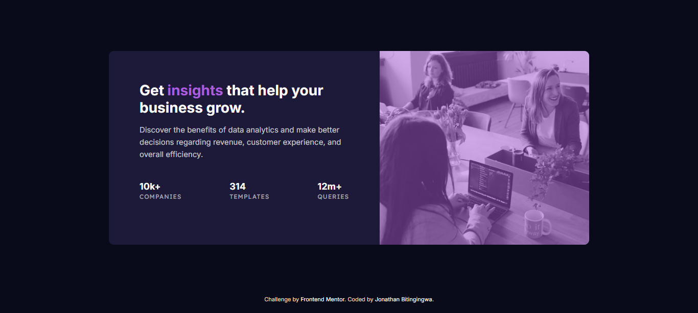

# Frontend Mentor - Profile card component solution

This is a solution to the [Profile card component challenge on Frontend Mentor](https://www.frontendmentor.io/challenges/stats-preview-card-component-8JqbgoU62). Frontend Mentor challenges help you improve your coding skills by building realistic projects. 

## Table of contents

- [Overview](#overview)
  - [Screenshot](#screenshot)
  - [Links](#links)
  - [My process](#my-process)
  - [Built with](#built-with)
  - [What I learned](#what-i-learned)
  - [Challenges](#Challenges)
  - [Continued development](#continued-development)
  - [Acknowledgments](#acknowledgments)
  - [Author](#author)

  ## 📸 Screenshot

---

## Links

- Solution URL: https://www.frontendmentor.io/solutions/jonathan-stats-preview-6vV78B6cZK
- Live Site URL: https://freedev-group.github.io/jonathan-stats-preview-card-component/

---

## Built With

- Semantic HTML5
- CSS3
- Flexbox
- Responsive design
- Google Fonts (Inter, Lexend Deca)

---

## Overview

This project is a responsive card component that displays key business insights and statistics. It includes:

- A modern card layout
- A responsive image with overlay effect
- Highlighted text using accent color
- Structured statistics section
- Mobile-first responsive design

## What I Learned

- Creating responsive layouts using Flexbox
- Structuring content for better readability
- Managing typography and spacing
- Working with multiple Google Fonts

## Challenges

- Positioning the image and applying a consistent overlay
- Structuring the stats section correctly
- Ensuring responsiveness between mobile and desktop views

I solved these by refining my layout structure and carefully applying CSS properties like `flex` and `object-fit`.

## Continued Development

In future projects, I plan to:

- Improve pixel-perfect accuracy
- Enhance accessibility (contrast, semantics)
- Add subtle animations for better user experience
- Write cleaner and more scalable CSS

## Acknowledgments

Special thanks to Mentor Samuel and the FreeDev Community for their support and guidance throughout this project.

## Author

- GitHub - [Jonathan_Bitingingwa]https://bitingingwa.github.io/My-portfolio/
